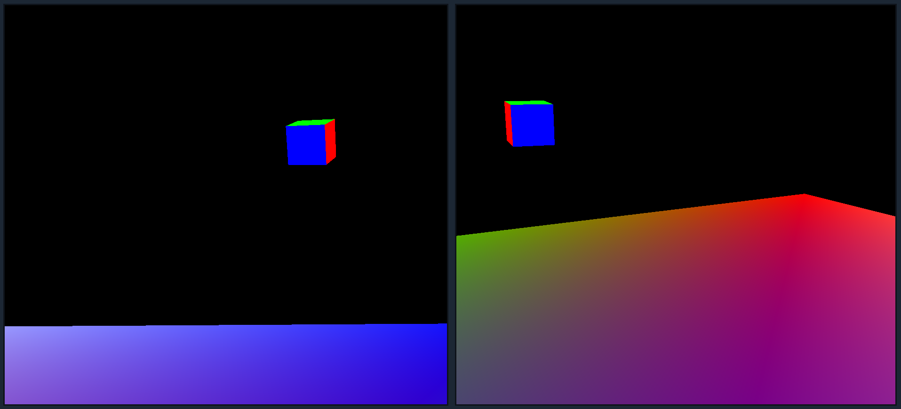

# Cube Head
An example of Client/Server networking for player movement.

## Running
* Server: `cargo run --release --bin server -- <optional: bind address>`
* Client: `cargo run --release -- <server address>`

For example, you might run the following commands in different terminals:
* Server: `cargo run --release --bin server -- 127.0.0.1:5031`
* Client(s): `cargo run --release -- 127.0.0.1:5031`

## TODO
- [x] VR support
- [ ] Use UDP or QUIC instead of TCP (faster!)
- [x] Better controls
- [ ] More interesting map
- [ ] Even better controls
- [ ] Exclude own head pos from rendering

